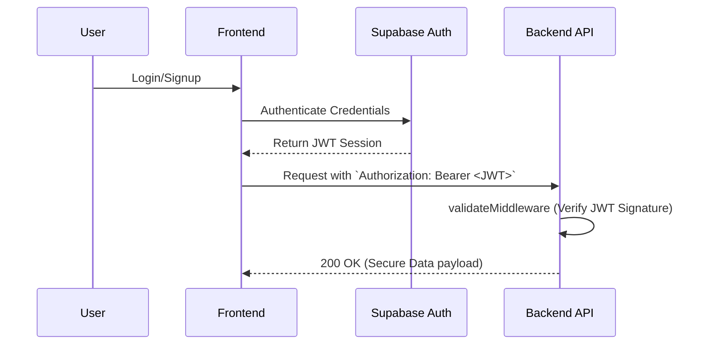
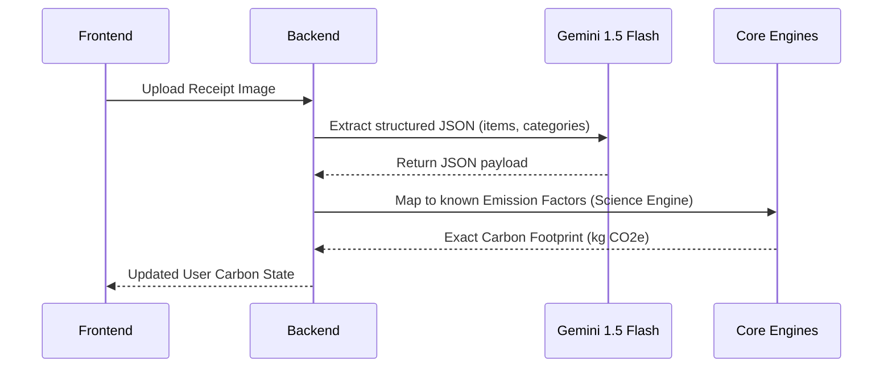
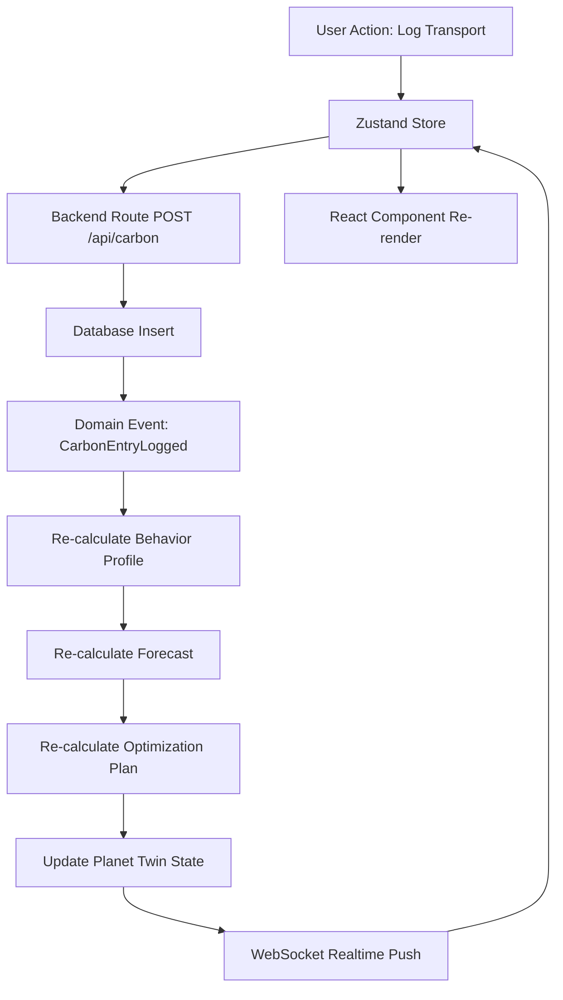
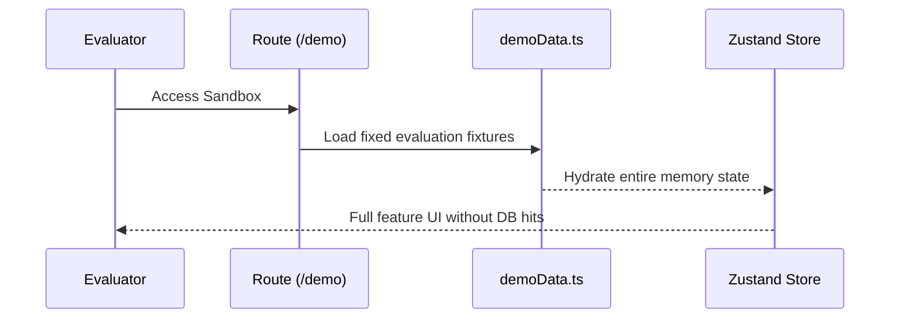

# CarbonSense X — System Architecture

## System Overview

CarbonSense X is built as a domain-driven, event-oriented **Carbon Intelligence Platform**. Instead of a traditional monolithic web application where business logic is tied to database routing or visual state controllers, CarbonSense isolates all domain calculations inside dedicated, testable packages.

The architecture strictly separates deterministic carbon science and forecasting math from probabilistic AI reasoning.

## Frontend Architecture

The frontend is a single-page application built for high-performance data visualization and immediate state reconciliation.

- **Framework**: React 18 with TypeScript.
- **State Management**: Zustand. Provides a lightweight, unopinionated global store (`carbonStore.ts`) that orchestrates the data flow across disparate UI components without triggering deep re-renders.
- **3D Visualization**: React Three Fiber (`@react-three/fiber`) and Drei. Renders the interactive Planet Twin, binding ecological state variables (temperature, forest cover) directly to 3D shaders and geometry.
- **Styling**: Tailwind CSS with Shadcn UI components.
- **Awareness Layer**: A newly implemented top-level presentation tier that aggregates outputs from the behavior and optimization engines to surface immediate carbon footprint transparency.

## Backend Architecture

The backend serves as a thin orchestration and persistence layer, routing data between the database, the computational engines, and the external AI models.

- **Runtime**: Node.js with Express/Fastify compatibility layers.
- **Engine Packages**: Seven modular packages handle the core intelligence.
  - `carbon-science-engine`: Deterministic math for kg CO2e conversions.
  - `behavior-intelligence-engine`: Classifies consumption patterns.
  - `carbon-dna-engine`: Generates the long-term cognitive archetype profile.
  - `optimization-engine`: MCDA ranking of mitigation interventions.
  - `forecast-engine`: 30/90/365-day trajectory calculations.
  - `planet-twin-engine`: Ecological state calculations for the 3D globe.
  - `receipt-intelligence-engine`: Parsers for structured data extraction.
- **AI Orchestration**: Isolated via `@carbonsense/ai-orchestration` to handle API bounds and rate limits.

## Authentication Flow

Authentication is managed via Supabase's native JWT implementation.

## AI Flow

AI is strictly utilized for **reasoning and parsing**, never for deterministic calculations.

## Data Flow

The application relies on an unidirectional data flow loop triggered by domain events (e.g., `CarbonEntryLogged`).

## Demo Mode Flow

A completely isolated sandbox flow that prevents database contamination.

## Deployment Architecture

- **Frontend**: Deployed via Vercel Edge Network for rapid global CDN delivery.
- **Backend**: Hosted on serverless functions or Railway.
- **Database**: Supabase Managed PostgreSQL.

## Tradeoffs and Decisions

**Problem**: Traditional LLM apps pass raw numbers to the AI to do math, resulting in hallucinations and incorrect footprints.
**Decision**: Isolate deterministic math in TypeScript packages.
**Tradeoff**: Increased code complexity and duplicate interface maintenance between AI schema outputs and local TS interfaces.
**Impact**: 100% mathematical integrity and predictable testing for all carbon data.
