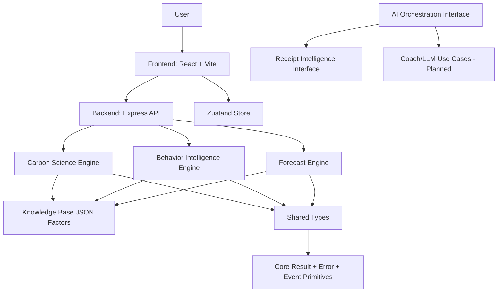

# CarbonOracle

<p align="left">
  
  
  
  
  
  
</p>

**Applied AI Carbon Intelligence Platform**

CarbonOracle is a monorepo for a production-oriented carbon intelligence system: auditable carbon calculation, behavioral pattern detection, multi-horizon forecasting, and a modular AI orchestration layer that can power receipt intelligence and coaching.

## Project Overview

Most carbon trackers stop at awareness: log activity, show a chart, end.

CarbonOracle exists to go beyond static tracking by combining:
- Scientific carbon accounting with confidence and uncertainty bounds
- Behavioral signal detection (patterns, trends, risk scoring)
- Forecasting across baseline, trend-adjusted, momentum, scenario, and counterfactual paths
- A modular architecture where domain engines are independently testable and reusable

What makes it different in its current implementation:
- The core intelligence is packaged as typed, testable engines in a workspace monorepo
- Carbon calculations are reproducible and auditable (factor selection reasoning + audit trail)
- Behavior and forecast layers are implemented as composable engines, not page-level logic
- AI integration is abstracted behind interfaces to avoid model/provider lock-in

## PromptWars Submission

This project was created as a submission for PromptWars.

The project follows a vibe-coding workflow where AI-assisted development, architectural planning, rapid iteration, and human engineering judgment are combined to build a production-oriented system in a compressed timeframe.

The implementation reflects:
- AI-assisted development in code generation and iteration speed
- Human architectural decisions in monorepo boundaries, engine isolation, and data contracts
- System design ownership through explicit RFCs, architecture docs, and phased guardrails
- Engineering validation through unit tests on core engines and strict TypeScript contracts
- Rapid iteration with progressive phase-based delivery

Final architecture, validation, and engineering decisions were human-directed.

## Key Features

| Feature | Status | Description |
|---|---|---|
| Carbon Science Engine | Implemented | Data-driven carbon computation using emission factors from `@carbonsense/knowledge-base` with audit details and uncertainty ranges |
| Behavior Intelligence Engine | Implemented | Detects behavior signals (beef frequency, car dependency, weekend spikes, shopping intensity, flight frequency), trends, and risk score |
| Forecast Engine | Implemented | Produces baseline, trend-adjusted, momentum, scenario, and counterfactual forecast outputs |
| Shared Domain Contracts | Implemented | Rich TypeScript models for user, carbon entries, behavior, forecast, optimization, DNA, simulation, and events |
| Backend API Foundation | Implemented | Express app with Helmet, CORS, JSON parsing, rate limiting, and health endpoint |
| Frontend Auth + Routing Shell | Implemented | React app with protected routes, auth UI, dashboard shell, and Zustand store |
| AI Orchestration Layer | Interface-ready | Abstraction for text/JSON/image model operations (`generateText`, `generateJson`, `analyzeImage`) |
| Receipt Intelligence | Interface-ready | Contract for image-based receipt analysis and structured carbon extraction |
| Optimization Engine | Interface-ready | Contract for recommendation generation and intervention ranking |
| Carbon DNA Engine | Interface-ready | Contract for profile generation and persona classification |
| Planet Twin Engine | Interface-ready | Contract for simulation state computation and time progression |

## Architecture

### System Architecture (Current)



### Frontend
- React 18 with route-level pages for landing, auth, dashboard, scanner, coach, community, profile
- Protected route gate and shared app layout
- Zustand-based app state (`user`, `session`, `carbonEntries`)
- Current UI state is intentionally skeletal/frozen for several pages while engine architecture is stabilized

### Backend
- Express server with security middleware stack
- Rate limiting on `/api/*`
- Health endpoint at `/api/health`
- Domain engine APIs are planned but not yet exposed as REST endpoints

### Database
- Supabase client configuration exists in frontend/backend dependencies and env examples
- Runtime persistence integration is not wired in current backend routes

### AI Systems
- `@carbonsense/ai-orchestration` defines provider-agnostic contracts for text/JSON/image tasks
- Gemini usage is documented in architecture and RFCs but no live Gemini SDK integration is present in this codebase yet

### Analytics
- Engine-level analytics and outputs exist: category breakdown, footprint scoring, behavior trends, risk signals, forecast profiles, risk drivers, counterfactuals

### Security
- Implemented: Helmet headers, CORS origin control, express-rate-limit, strict TS typing, Zod input validation in Carbon Science Engine
- Planned: authenticated API middleware, RLS-backed persistence routes, AI endpoint hardening

### Infrastructure
- Monorepo workspaces with independently buildable packages
- Frontend and backend run independently during development
- Deployment targets are documented (Vercel/Railway/Supabase) but CI/CD and deployment manifests are not yet in this repository

## Technology Stack

| Layer | Technologies |
|---|---|
| Monorepo | npm workspaces |
| Language | TypeScript |
| Frontend | React 18, Vite 5, React Router 6, Zustand, Tailwind CSS, Framer Motion, Lucide React |
| Backend | Node.js, Express 4, Helmet, CORS, express-rate-limit, dotenv |
| Shared Packages | `@carbonsense/core`, `@carbonsense/shared-types`, `@carbonsense/knowledge-base` |
| Intelligence Engines | Carbon Science, Behavior Intelligence, Forecast, Optimization (contract), Carbon DNA (contract), Receipt Intelligence (contract), Planet Twin (contract) |
| Validation | Zod |
| Testing | Vitest, @vitest/coverage-v8 |
| Data/Auth Integration Target | Supabase (`@supabase/supabase-js`) |
| AI Integration Target | Gemini via orchestration abstraction |

## Project Structure

```text
PromptWars/
├── agents/                         # Build bible, execution guardrails, prompt docs
├── backend/                        # Express API server
│   ├── src/index.ts                # Security middleware + /api/health
│   └── .env.example
├── frontend/                       # React web app
│   ├── src/components/             # Layout + route guards
│   ├── src/pages/                  # Landing/Auth/Dashboard/Scanner/Coach/Community/Profile
│   ├── src/store/                  # Zustand store
│   ├── src/lib/                    # Supabase client setup
│   └── .env.example
├── packages/
│   ├── core/                       # Result type, base errors, domain event primitives
│   ├── shared-types/               # Cross-layer domain models
│   ├── knowledge-base/             # Emission factors + methodology + thresholds + scenarios
│   ├── carbon-science-engine/      # Implemented carbon calculation engine
│   ├── behavior-intelligence-engine/ # Implemented behavior engine
│   ├── forecast-engine/            # Implemented forecasting engine
│   ├── ai-orchestration/           # AI abstraction interfaces
│   ├── optimization-engine/        # Interface contract
│   ├── carbon-dna-engine/          # Interface contract
│   ├── receipt-intelligence-engine/# Interface contract
│   └── planet-twin-engine/         # Interface contract
├── docs/                           # Architecture, RFCs, roadmap, research
├── research/                       # Dataset/methodology/reference placeholders
└── package.json                    # Workspace scripts
```

## Installation

### Prerequisites
- Node.js 18+
- npm 9+

### 1. Clone
```bash
git clone <your-repository-url>
cd PromptWars
```

### 2. Install Dependencies
```bash
npm run install:all
```

### 3. Configure Environment
Create local env files from the examples:
- `backend/.env` (from `backend/.env.example`)
- `frontend/.env` (from `frontend/.env.example`)

### 4. Run Locally (Frontend + Backend)
```bash
npm run dev
```

Or run each service independently:
```bash
npm run dev:frontend
npm run dev:backend
```

### 5. Build
```bash
npm run build
```

### 6. Test
```bash
npm test
```

### Database Setup
The repository currently ships with Supabase configuration placeholders and contracts. Concrete schema migrations and active persistence routes are not yet included in backend runtime code.

## Environment Variables

| Variable | Scope | Required | Purpose |
|---|---|---|---|
| `PORT` | Backend | Optional | API server port (default `5000`) |
| `FRONTEND_URL` | Backend | Optional | Allowed CORS origin (default `http://localhost:5173`) |
| `SUPABASE_URL` | Backend | Planned | Supabase backend endpoint |
| `SUPABASE_SERVICE_ROLE_KEY` | Backend | Planned | Service-level backend Supabase access |
| `GEMINI_API_KEY` | Backend | Planned | Model API key for receipt/coach AI routes |
| `VITE_SUPABASE_URL` | Frontend | Optional (mock fallback exists) | Supabase project URL for client auth/data |
| `VITE_SUPABASE_ANON_KEY` | Frontend | Optional (mock fallback exists) | Supabase anon client key |
| `VITE_API_URL` | Frontend | Planned | Backend base URL for API integration |

## Usage

### Current User Workflow
1. Open the web app landing page
2. Navigate to auth and sign in/sign up (mock fallback path is implemented)
3. Access protected dashboard shell
4. Inspect profile and navigation targets for scanner/coach/community pages
5. Engine capabilities are currently consumed at package/test level rather than fully wired UI/API flows

### Walkthrough Placeholders
- Screenshot placeholder: `docs/screenshots/landing.png`
- Screenshot placeholder: `docs/screenshots/auth.png`
- Screenshot placeholder: `docs/screenshots/dashboard.png`
- Screenshot placeholder: `docs/screenshots/engines-tests.png`

## Security

Implemented today:
- HTTP hardening with Helmet
- CORS policy with configurable frontend origin
- API rate limiting (`/api/*`)
- Strict TypeScript contracts across layers
- Input validation in carbon calculation flow using Zod

Current gaps (tracked in docs/roadmap):
- No authenticated backend business endpoints yet
- No authorization checks for user-owned resources yet (because CRUD routes are pending)
- No active server-side AI routes yet

## AI Components

### Present in Codebase
- AI orchestration abstraction interface (`generateText`, `generateJson`, `analyzeImage`)
- Receipt intelligence and coaching design reflected in RFCs and engine contracts

### Not Yet Wired at Runtime
- No provider SDK integration in backend runtime routes
- No prompt execution pipeline in deployed API surface

### Prompting & Safety Direction (Documented)
- Structured JSON outputs for multimodal receipt analysis
- Backend-only secret handling for model keys
- Rate limiting and validation requirements for AI endpoints

### Cost Considerations (Documented Targets)
- Gemini free-tier assumptions are documented in architecture/build docs
- Runtime token/cost controls are planned, not implemented in route handlers yet

## Performance

Implemented:
- Workspace-level package isolation for focused builds
- Vite frontend build pipeline
- Engine logic separated from UI for easier profiling and testing

Planned but not yet runtime-implemented:
- API caching strategy
- Persistence-layer query optimization and aggregates
- Full lazy-route and heavy visualization optimization passes

Scalability design indicators:
- Domain model separation (`core`, `shared-types`, engine packages)
- Forecast/behavior computation abstracted into stateless, testable modules
- JSON knowledge base decoupled from engine logic

## Roadmap

### Completed
- Monorepo foundation (`core`, `shared-types`, `knowledge-base`, orchestration layer)
- Carbon Science Engine implementation with robust tests
- Behavior Intelligence Engine implementation with robust tests
- Forecast Engine implementation with robust tests
- Frontend auth + routing + dashboard skeleton
- Backend secure server skeleton with health endpoint

### In Progress
- Wiring engines into backend domain routes
- Converting frontend placeholders into live feature pages
- Integrating Supabase persistence into operational flows

### Future Vision
- Optimization engine implementation and intervention ranking
- Carbon DNA profile generation implementation
- Receipt intelligence runtime integration (multimodal AI)
- Planet twin simulation implementation + immersive visualization layer
- Community-level real-time analytics and richer API surface
- CI/CD hardening and production deployment manifests

## Development Philosophy

CarbonOracle uses a domain-first architecture:
- Business logic in versioned engine packages, not UI components
- Shared contracts as the single source of truth across frontend/backend
- Explicit Result/Error patterns for predictable control flow
- Guardrailed phase execution to prevent premature feature coupling
- Test-driven confidence on core scientific and behavioral logic

This approach prioritizes maintainability, scientific traceability, and incremental scalability over fast but brittle feature shipping.

## Contributing

1. Fork the repository
2. Create a feature branch (`feat/<scope>-<short-name>`)
3. Keep changes scoped to one concern (engine, frontend, backend, docs)
4. Add or update tests for behavioral changes
5. Run:
```bash
npm test
npm run build
```
6. Open a pull request with:
- Problem statement
- Design approach
- Test evidence
- Backward-compatibility notes

## License

No license file is currently present in this repository.

Until a license is added, default copyright applies (all rights reserved).
