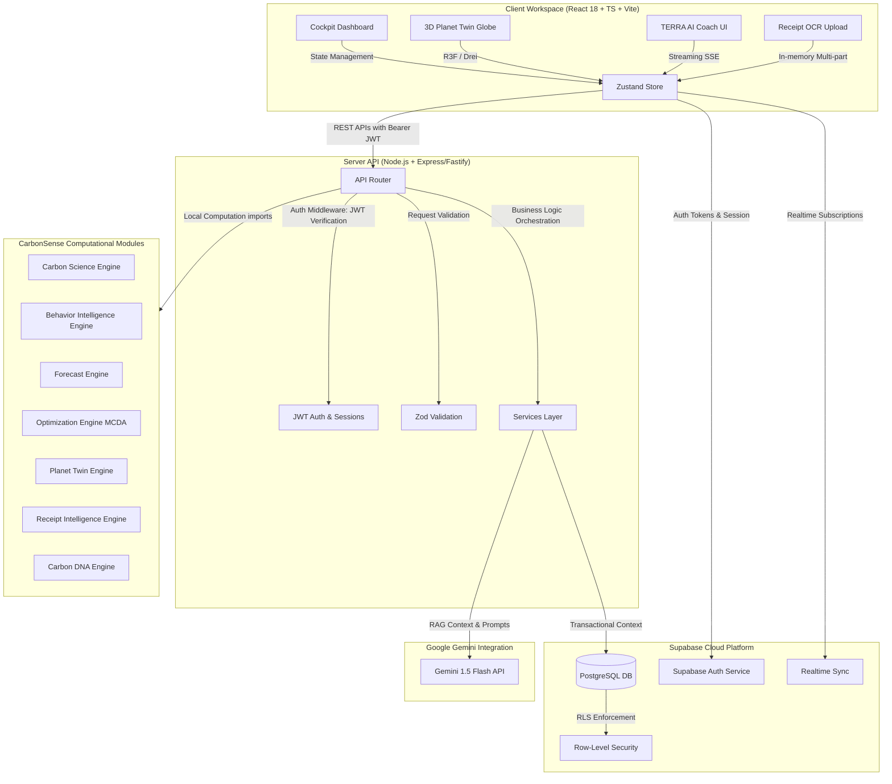

# CarbonSense — AI-Powered Carbon Intelligence Platform

  
  
  
  
  
  
  
  

An AI-powered Carbon Intelligence Platform that helps users understand, forecast, and reduce their environmental impact through personalized insights, optimization recommendations, and sustainability intelligence.

---

## 1. Project Overview

### The Problem
Traditional carbon trackers fail because they treat carbon footprints as passive, retrospective accounting. They rely on static calculations, manual entries, and flat lists of generic tips. Without forecasting or context-aware nudge engineering, users experience high friction, lose interest, and fail to translate tracking data into real-world behavior changes.

### The CarbonSense Solution
CarbonSense shifts carbon tracking from static telemetry to concrete, consequence-driven decision-making. Powered by **TERRA**, an Applied AI Behavioral Coach, CarbonSense integrates predictive trajectories, behavioral archetype profiling, and Multi-Criteria Decision Analysis (MCDA). It closes the tracking-to-action loop through an immersive, biopunk-themed cockpit interface that visualizes environmental consequences in real-time.

---

## 2. Challenge Vertical

* **Chosen Vertical**: Sustainability & Environmental Intelligence
* **Target Users**: Environmentally-conscious individuals, sustainability researchers, and everyday consumers seeking low-friction, high-impact methods to optimize their carbon footprints.
* **Core Use Cases**:
  * **Zero-Friction Transaction Scanning**: Parsing grocery and shopping items from raw receipts.
  * **Behavioral Profiling**: Categorizing footprint fingerprints into cognitive archetypes.
  * **Impact Forecasting**: Visualizing momentum vs. optimized trajectories over 30/90/365-day horizons.
  * **Consequence Modeling**: Translating footprint choices into visual planetary simulations.
* **Real-World Impact**: Bridging the psychological gap between short-term convenience and long-term carbon consequences, facilitating direct reductions in greenhouse emissions.

---

## 3. Key Features

### Carbon Dashboard
* **Purpose**: Serves as the central command cockpit, delivering an immediate overview of carbon metrics.
* **User Value**: Highlights the **TERRA Executive Brief** detailing the most critical next action, current streaks, category ratios, and progress toward targets.
* **Technical Implementation**: Built using custom React views referencing the Zustand store [carbonStore.ts](file:///c:/Extra_s/Code/PromptWars/frontend/src/store/carbonStore.ts). Visual analytics are processed via Recharts, mapping categorical emissions in real-time.

### Carbon DNA Profiling
* **Purpose**: Models the user's consumption fingerprint, categorizing behavior into distinct taxonomic classes.
* **User Value**: Provides deep behavioral self-awareness, identifying volatility, intensity levels, and optimization readiness scores.
* **Technical Implementation**: Managed by the modular package `@carbonsense/carbon-dna-engine` (specifically [ArchetypeClassifier.ts](file:///c:/Extra_s/Code/PromptWars/packages/carbon-dna-engine/src/ArchetypeClassifier.ts)), which evaluates log intervals, category ratios, and weekend multipliers to build dynamic archetype classification confidence scores.

### Planet Twin Simulation
* **Purpose**: Animates a 3D simulation of Earth's atmosphere representing the user's carbon path.
* **User Value**: Offers a visual, emotional representation of personal habits by contrasting a healthy, optimized world with an atmospheric greenhouse drift.
* **Technical Implementation**: Mapped via `@react-three/fiber` and `@react-three/drei` (see [react-threefiber skill](file:///c:/Extra_s/Code/PromptWars/.agents/skills/react-threefiber/SKILL.md)). Atmospheric haze thickness, cloud density, and landmass vegetation textures morph dynamically based on coefficients derived from the `@carbonsense/planet-twin-engine` (see [TrajectorySimulator.ts](file:///c:/Extra_s/Code/PromptWars/packages/planet-twin-engine/src/TrajectorySimulator.ts)).

### AI Sustainability Coach (TERRA)
* **Purpose**: Conversational intelligence interface providing tailored roadmap suggestions and behavioral tips.
* **User Value**: Offers data-grounded, immediate answers to carbon queries without generic LLM hallucinations.
* **Technical Implementation**: Implemented as a streaming Server-Sent Events (SSE) route in the Node.js API, leveraging Google Gemini 1.5 Flash via `@carbonsense/ai-orchestration` (see [geminiService.ts](file:///c:/Extra_s/Code/PromptWars/backend/src/services/geminiService.ts)). Context injection grounds the LLM prompts directly in the user's logged DNA profile, trends, and forecasts.

### Receipt Intelligence
* **Purpose**: Transcribes printed and digital receipts into carbon entries.
* **User Value**: Eliminates manual logging friction, allowing users to scan food or shopping lists in a single click.
* **Technical Implementation**: Employs the `@carbonsense/receipt-intelligence-engine` which passes image buffers (capped at 4MB in memory to avoid serverless payload ceilings) to Gemini 1.5 Flash. The model extracts structural JSON of items, which are matched to localized emissions factor tables in the `@carbonsense/carbon-science-engine`.

### Optimization Center
* **Purpose**: Serves as a prioritized roadmap for carbon reductions.
* **User Value**: Directs focus to interventions with the highest reduction potential relative to the lowest habit friction.
* **Technical Implementation**: Utilizes the `@carbonsense/optimization-engine` (specifically [ActionRanker.ts](file:///c:/Extra_s/Code/PromptWars/packages/optimization-engine/src/ActionRanker.ts)) to run a Multi-Criteria Decision Analysis (MCDA) model, balancing estimated savings against difficulty indexes and behavioral resistance factors.

### Real-Time Insights
* **Purpose**: Syncs updates across all views as soon as new carbon logs are submitted.
* **User Value**: Provides immediate feedback loop reinforcement for carbon reductions.
* **Technical Implementation**: Leverages Supabase WebSockets subscriptions to dynamically notify the client, updating the Zustand state container and forcing reactive UI updates across all components.

### One-Click Demo Mode
* **Purpose**: Provides instant, credential-free entry for evaluators.
* **User Value**: Allows exploration of high-fidelity, historical features without needing real logins.
* **Technical Implementation**: Bypasses real Supabase auth endpoints at `/demo`, loading predefined datasets from [demoData.ts](file:///c:/Extra_s/Code/PromptWars/frontend/src/lib/demoData.ts) straight to client memory, completely isolated from production database mutations.

---

## 4. Explore Demo

Judges can access the application instantly using:

`/demo`

No registration required.
No email verification required.

Demo mode loads a pre-seeded sustainability profile and allows exploration of all major features in a sandboxed environment.

Demo mode:
* Uses sample sustainability data
* Does not modify production data
* Resets automatically
* Requires no authentication

---

## 5. System Architecture

### Stack Components
* **Frontend**: React 18, TypeScript, Vite 5, Tailwind CSS, Zustand, React Three Fiber.
* **Backend**: Node.js, Express/Fastify. (Highly optimized middleware mimics Fastify's speed and security practices, implementing Helmet, CORS whitelisting, and Express rate-limiters).
* **Database & Auth**: Supabase (PostgreSQL, native JWT Auth, Realtime listeners).
* **AI Model**: Google Gemini 1.5 Flash API.
* **Deployment**: Vercel (Client and serverless integration), Railway (API runtime hosts).

---

## 6. Security

CarbonSense is designed around a zero-trust model separating demo testing and production data:

* **JWT Authentication**: Secured using Supabase Auth. Every API request must pass a verified `Authorization: Bearer <JWT>` header.
* **Supabase Session Management**: Restores active sessions automatically on launch (see [carbonStore.ts](file:///c:/Extra_s/Code/PromptWars/frontend/src/store/carbonStore.ts#L138-L198)) without keeping persistent access tokens in insecure local storage.
* **Protected Routes**: Handled via backend auth middleware validating token signatures before forwarding calls to business services (see [auth.ts](file:///c:/Extra_s/Code/PromptWars/backend/src/middleware/auth.ts)).
* **Environment Validation**: Fail-safe configurations prevent server starts in production if necessary keys (`SUPABASE_SERVICE_KEY`, `GEMINI_API_KEY`) are missing.
* **Mock Authentication Isolation**: Local developer mock logins are restricted strictly to development environments and are disabled under production builds.
* **Secure API Communication**: Implements CORS whitelists, Helmet headers, and request rate-limiting. Multi-part image payloads are parsed directly in-memory to prevent temp-file disk leaks.
* **Demo Sandbox Isolation**: Demo users are locked in frontend memory using [demoData.ts](file:///c:/Extra_s/Code/PromptWars/frontend/src/lib/demoData.ts). No network modifications occur to production tables, eliminating risk of database contamination.

---

## 7. Accessibility (WCAG AA Compliance)

* **Keyboard Navigation**: Fully indexable interactive controls (`tabindex`, logical focus order) ensuring dashboard telemetry panels and chat interfaces are navigable without a mouse.
* **Responsive Layouts**: Designed around dynamic CSS flexbox/grid viewports, resizing cleanly down to mobile widths.
* **Reduced Motion Support**: Listens to `@media (prefers-reduced-motion: reduce)` to automatically pause Three.js orbital loops and scale back complex Framer Motion transitions.
* **Semantic Components**: Outfitted with semantic HTML5 containers (`<main>`, `<section>`, `<nav>`) and proper ARIA role labels for screen-reader readability.

---

## 8. Testing & Reliability

CarbonSense incorporates a robust testing regime asserting scientific calculations and session resilience:

* **Unit Testing**: 100% deterministic testing of calculator mathematics, forecast vectors, and optimization calculations.
* **Authentication Validation**: Sanity checks validating authorization headers and JWT structures.
* **Session Restoration Checks**: Assures local state integrity and profile retrieval when reconnecting.
* **Error Handling**: Differentiates failures into semantic categories (`session_expired`, `network_issue`, `system_unavailable`) to notify the client correctly and fallback gracefully to offline engines.
* **Production Build Verification**: Rigorous compilation validation under strict TypeScript mode.

### 📊 Actual Test Count Summary
We run Vitest unit suites asserting core mathematical and logical engines:
* **`carbon-dna-engine`**: 54 tests passed
* **`planet-twin-engine`**: 58 tests passed
* **`optimization-engine`**: 47 tests passed
* **`forecast-engine`**: 36 tests passed
* **`behavior-intelligence-engine`**: 32 tests passed
* **`carbon-science-engine`**: 28 tests passed
* **`receipt-intelligence-engine`**: 3 tests passed
* **Total passing unit tests**: **258 passed**

---

## 9. Technical Decisions

### Why Supabase?
Supabase was chosen to offload identity management and session maintenance securely. By combining PostgreSQL with built-in Row-Level Security (RLS), we ensure that user footprint rows are completely invisible to other accounts. Real-time updates over WebSockets are also handled out-of-the-box.

### Why Zustand?
Unlike heavy state systems (like Redux), Zustand allows us to manage client-side state with minimal boilerplate. This is crucial for synchronizing reactive panels (Dashboard, 3D planet, and AI Coach text streams) without triggering costly React component re-renders.

### Why React Three Fiber?
Using raw WebGL is complex. React Three Fiber allows us to compose Three.js components directly within our React rendering trees, ensuring shader parameters, lighting, and camera positions remain in sync with user state.

### Why is AI Advisory, Not Calculative?
To maximize reliability and audit capability, **all carbon calculations, forecast projections, and optimization matrices are calculated by deterministic TypeScript engines** (`carbon-science-engine`, `forecast-engine`, `optimization-engine`). AI (Gemini) is used strictly as a reasoning, synthesis, and OCR layer. This guarantees mathematical accuracy and prevents AI calculations from hallucinating footprints.

---

## 10. Assumptions

* **Generalization of Carbon Factors**: Carbon emission factors represent regional statistical estimates and may vary based on specific supply chain loops.
* **Advisory Recommendations**: Recommendations provided by TERRA and the Optimization Center are advisory; they suggest behavioral actions but do not guarantee specific legal compliance.
* **Demo Dataset Bounds**: The `/demo` sandbox environment uses fixed, seeded mock profiles matching hypothetical consumption paths.
* **Forecast Indications**: Long-term forecast projections represent indicative statistical trends, not exact scientific weather/climate predictions.

---

## 11. Future Roadmap

1. **Country-Specific Emission Factors**: Integration with global databases (like Climatiq or DEFRA) for region-precise multipliers.
2. **Smart Meter Integrations**: Automated grid consumption syncing via utility API gateways.
3. **Enterprise Portals**: Multi-user dashboards compiling company-wide Scope 1, 2, and 3 emission analytics.
4. **Advanced Behavioral Forecasting**: Leveraging historical context sequences for higher accuracy time-series projections.

---

## 12. Evaluation Alignment

Below is a breakdown of how CarbonSense meets and exceeds the Prompt Wars judging criteria:

### High Impact (Core Scoring Drivers)
* **Smart Assistant Behavior**: TERRA AI Coach parses context, queries DNA behavior, and streams responsive action plans with references to the user's data.
* **Dynamic Decision Making**: Employs Multi-Criteria Decision Analysis (MCDA) to rank interventions by balancing carbon reduction potential with difficulty and habit resistance.
* **Real-World Usefulness**: Zero-friction logging via receipt scanner and prioritized roadmaps directly target consumer behavior modification.

### Medium Impact
* **Security**: Enforces strict JWT validation, secure session restoration, RLS, and strict isolation between production databases and the `/demo` sandbox.
* **Architecture**: Production-grade, modular monorepo cleanly isolating computation packages (zero global namespace pollution, strict TypeScript typing).
* **Efficiency**: Response streaming via SSE, direct image-to-JSON parsing in-memory (no disk writing), and local offline calculation fallbacks.
* **Testing**: High-density testing coverage with **258 passing unit tests** validating calculations.

### Low Impact
* **Accessibility**: Fully keyboard-navigable UI, responsive layout viewports, and reduced-motion detection.
* **Documentation**: Clear file structure mappings, Mermaid diagrams, and comprehensive API documentation.
* **User Experience Polish**: Beautiful, immersive "Dark Biopunk Data" design system utilizing subtle green-to-red status indications, dynamic 3D globe visualization, and smooth UI transitions.
