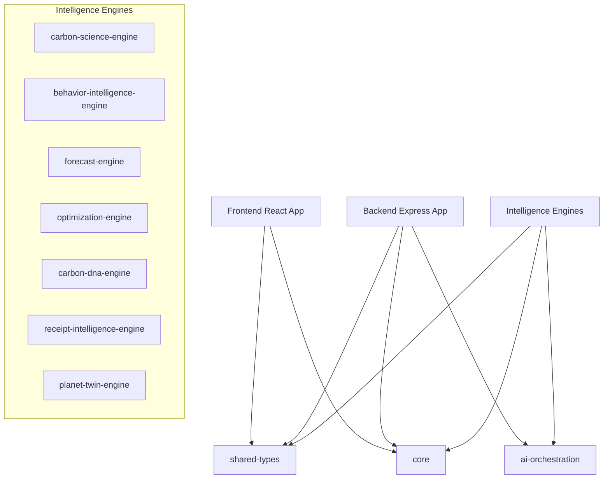

# CarbonSense X — System Architecture

## Overview

CarbonSense X is built as a domain-driven, event-oriented Carbon Intelligence Platform. Instead of a traditional monolithic web application where business logic is tied to database routing or visual state controllers, CarbonSense X isolates all domain calculations inside dedicated, testable packages.

---

## Workspace Modules

1. **`@carbonsense/core`**: Scaffolds common error types, Result utility templates, configuration properties, and the foundation of the event schema.
2. **`@carbonsense/shared-types`**: The single source of truth for interfaces and types. Both frontend and backend consume these models directly.
3. **`@carbonsense/ai-orchestration`**: Decouples underlying large language models (such as Gemini 1.5 Flash) from business logic to prevent vendor lock-in.
4. **Intelligence Engines (`packages/*-engine`)**: Independent libraries carrying contract interfaces for calculation, prediction, profiling, and simulation.

---

## Event-Driven Design

All engine updates and actions are logged as domain events adhering to the base `DomainEvent` contract:

- `CarbonEntryLogged`
- `ReceiptAnalyzed`
- `ForecastGenerated`
- `OptimizationPlanCreated`
- `CarbonDNAUpdated`
- `PlanetTwinUpdated`
