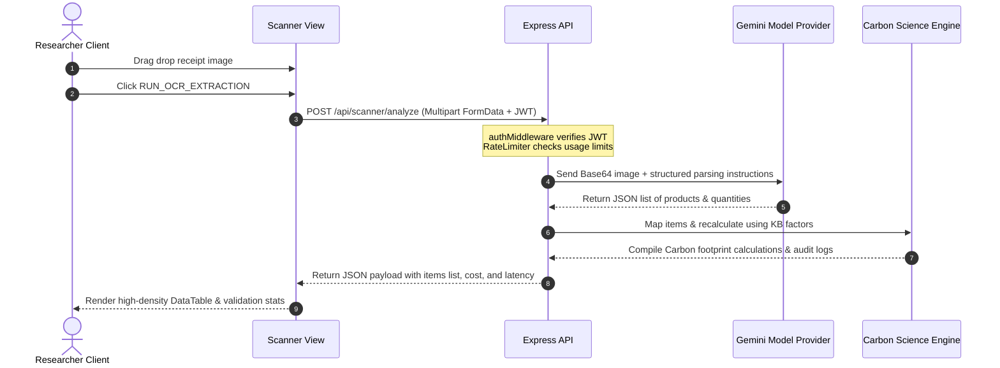
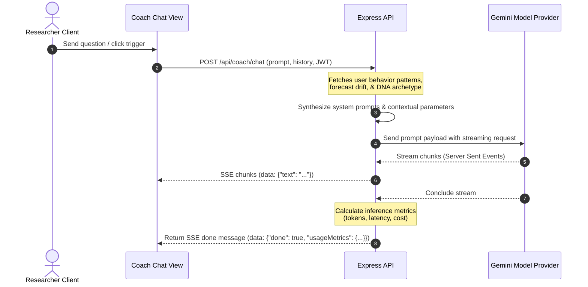

# CarbonSense — Technical Operation & End-to-End System Walkthrough

This document provides a highly detailed technical breakdown of how CarbonSense (CarbonOracle) operates under the hood. It maps directory architectures, domain engines, mathematical formula schemas, API payloads, prompt designs, and front-to-back operational flows.

---

## 1. System Directory Architecture & Package Structure

CarbonSense is organized as an npm workspaces monorepo:

```text
PromptWars/
├── backend/                             # Express Node.js API server
│   ├── src/
│   │   ├── index.ts                     # Main entrypoint, Helm security, mounting routers
│   │   ├── routes/
│   │   │   ├── coach.ts                 # /api/coach/chat (SSE prompt streaming)
│   │   │   └── scanner.ts               # /api/scanner/analyze (Multipart file upload)
│   │   ├── middleware/
│   │   │   ├── auth.ts                  # JWT verification stub & Supabase token hook
│   │   │   └── rateLimit.ts             # Express rate limit rule mappings
│   │   └── services/
│   │       ├── profileService.ts        # Dynamic context synthesis & mock DB fallbacks
│   │       ├── geminiService.ts         # Registers backend Gemini API provider
│   │       ├── CoachPromptBuilder.ts    # System prompt builder injecting telemetry
│   │       ├── CoachContextBuilder.ts   # Formatting helper for LLM contexts
│   │       └── ReceiptValidationService.ts # OCR schema validator
│   └── package.json
│
├── frontend/                            # Vite React SPA client
│   ├── src/
│   │   ├── components/
│   │   │   ├── 3d/
│   │   │   │   ├── PlanetTwinScene.tsx  # Canvas layout rendering Earth mesh
│   │   │   │   └── AIOrb.tsx            # Pulsing R3F icosahedron representing coach
│   │   │   ├── CommandPalette.tsx       # Cmd+K navigation & telemetry control modal
│   │   │   ├── Layout.tsx               # Main layout pane, sidebar, health meters
│   │   │   └── ui/                      # Refactored design system components
│   │   ├── pages/                       # Pages matching client cockpit views
│   │   ├── store/
│   │   │   └── carbonStore.ts           # Zustand global state (telemetry, session)
│   │   ├── lib/
│   │   │   ├── api.ts                   # Fetch triggers, SSE stream reader
│   │   │   └── supabase.ts              # Supabase client instantiation
│   │   └── index.css                    # CSS style base
│   └── package.json
│
└── packages/                            # Internal Business Logic Workspace
    ├── core/                            # Result types & base error classes
    ├── shared-types/                    # Cross-workspace TypeScript data structures
    ├── knowledge-base/                  # Factor datasets, scenarios, metadata
    ├── carbon-science-engine/           # Data-driven scientific carbon calculator
    ├── behavior-intelligence-engine/    # Consumption pattern scraper & signal detector
    ├── forecast-engine/                 # Predictive cumulative polynomial pathings
    ├── optimization-engine/             # Multi-Criteria Decision Analysis (MCDA) ranker
    ├── carbon-dna-engine/               # User taxonomy classification profiles
    ├── planet-twin-engine/              # World trajectory state simulations
    ├── ai-orchestration/                # Abstract LLM wrappers & tokens trackers
    └── receipt-intelligence-engine/     # Structured AI Vision receipt scraper
```

---

## 2. Mathematical Logic & Calculation Engines

The `@carbonsense` engines process calculations statelessly based on data contracts.

### 2.1. Carbon Science Engine (`@carbonsense/carbon-science-engine`)
Calculates the carbon footprint ($E_{total}$ in kg CO₂e) based on activity input and factors retrieved from `@carbonsense/knowledge-base`:

$$E_{total} = Q \times EF \times C$$

Where:
* $Q$ = Input Quantity.
* $EF$ = Emission Factor (kg CO₂e/unit).
* $C$ = Conversion multiplier (if unit conversion is needed).

#### Uncertainty Calculations
Uncertainty percent ($U\%$) is declared within the emission factor data. The engine computes the upper and lower bounds ($E_{upper}, E_{lower}$) as:

$$E_{lower} = E_{total} \times \left(1 - \frac{U}{100}\right)$$

$$E_{upper} = E_{total} \times \left(1 + \frac{U}{100}\right)$$

#### Factor Selection Algorithm
1. The engine checks for a country-specific override (e.g. India electricity grid factor).
2. If absent, it queries global defaults.
3. Selection reasoning, fallback tags, and valid dates are appended to a `CalculationAudit` object for auditability.

---

### 2.2. Behavior Intelligence Engine (`@carbonsense/behavior-intelligence-engine`)
Analyzes logging patterns to generate standard deviations and classify behavior signals.

#### Volatility Calculation (Standard Deviation)
Measures the consistency of logging behavior over a period of $N$ days:

$$\mu = \frac{1}{N} \sum_{i=1}^{N} E_i$$

$$\sigma = \sqrt{\frac{1}{N} \sum_{i=1}^{N} (E_i - \mu)^2}$$

#### Signal Detection Criteria
* **High Car Dependency**: Transport Category Emissions / Total Emissions > 0.70.
* **Frequent Beef Consumption**: Food entries with subcategory `beef` log count > 4 over a 30-day window.
* **Weekend Spikes**: $\mu_{weekend} / \mu_{weekday} > 1.5$.

---

### 2.3. Forecast Engine (`@carbonsense/forecast-engine`)
Projects baseline, momentum, and optimized cumulative trajectories over $H$ days.

#### Polynomial Projection
Accumulation functions model future trajectories using polynomial growth paths:

$$E(t) = \sum_{d=1}^{t} (\mu + r \cdot d)$$

Where:
* $\mu$ = Current daily emissions mean.
* $r$ = Growth multiplier/drift coefficient:
  * **Baseline**: $r > 0$ (positive drift reflecting unmitigated consumption).
  * **Momentum**: $r \approx 0$ (stable state).
  * **Optimized**: $r < 0$ (negative drift reflecting adoption of reduction actions).

---

### 3.4. Optimization Engine (`@carbonsense/optimization-engine`)
Ranks recommendations using Multi-Criteria Decision Analysis (MCDA).

#### Scoring Model
Each candidate intervention is scored out of 100 based on savings, difficulty, and resistance weights:

$$Score = w_s \cdot S - w_d \cdot D - w_r \cdot R$$

Where:
* $S$ = Expected monthly carbon savings (normalized, weight $w_s = 0.5$).
* $D$ = Implementation difficulty index (normalized, weight $w_d = 0.2$).
* $R$ = Habitual resistance score (normalized, weight $w_r = 0.3$).

---

### 2.5. Planet Twin Simulation (`@carbonsense/planet-twin-engine`)
Computes environmental indices based on cumulative emissions:

1. **Earth Overshoot Index ($E_{required}$)**:
   $$E_{required} = \frac{E_{annual\_projected}}{Global\_Target\_Cap}$$
   * Target Cap = 2,000 kg CO₂e / user.
2. **Atmospheric Carbon Drift (PPM)**:
   $$PPM = 415 + (E_{cumulative} \times 1.2 \cdot 10^{-6})$$
3. **Forest Hectare Offset Equivalent**:
   $$Hectares = \frac{E_{annual\_projected}}{2200}$$
   * Assumes 2,200 kg CO₂e absorbed annually per mature tree hectare.

---

## 3. Data Schema & Zod Validators

Requests and responses enforce strict schemas:

### 3.1. User Profile Schema (`profiles` table)
```typescript
interface UserProfile {
  id: string;                      // Supabase UUID
  username: string;                // Display name
  avatarUrl: string | null;        // URL path
  country: string;                 // Two-letter country code
  isOnboarded: boolean;            // Setup tracker
  targetReductionGoal: number;     // Range 0-100%
  createdAt: Date;
}
```

### 3.2. Carbon Entry Schema (`carbon_entries` table)
```typescript
interface CarbonEntry {
  id: string;                      // Entry UUID
  userId: string;
  category: 'transport' | 'food' | 'energy' | 'shopping';
  subCategory: string;
  amountKg: number;
  source: 'manual' | 'scanner' | 'ai_coach';
  metadata: {
    quantity?: number;
    unit?: string;
    details?: string;
  };
  loggedAt: Date;
}
```

---

## 4. End-to-End Operational Flows

### 4.1. Receipt Scanner Operations (`Scanner.tsx` → `/api/scanner/analyze`)



#### Structured Gemini OCR Instruction
```text
System Prompt:
You are an expert environmental carbon accountant.
Analyze the provided receipt/utility bill image. Extract all transaction items and estimate their weight/count.
You must respond only with a valid JSON payload matching this typescript definition:
{
  "items": Array<{
    "name": string,
    "quantity": number,
    "unit": string,
    "category": "transport" | "food" | "energy" | "shopping",
    "subCategory": string
  }>,
  "confidence": number // Range 0.0 - 1.0
}
```

---

### 4.2. Conversational TERRA Chat Operations (`Coach.tsx` → `/api/coach/chat`)



#### Dynamic Prompts Context Synthesis
```text
[System Context Structure]:
You are TERRA, an expert carbon footprint coach.
The user is classified under the archetype: {{carbonDNAProfile.archetype}} (Confidence: {{carbonDNAProfile.archetypeConfidence}}%).
Active Behavioral Signals:
- {{behaviorProfile.signals.map(s => s.description).join(', ')}}
Baseline annual projection: {{planetTwinProfile.currentWorld.trajectory.annualEmissionsKg}} kg.
Optimized annual target: {{planetTwinProfile.optimizedWorld.trajectory.annualEmissionsKg}} kg.
Priority reduction recommendations:
- {{optimizationPlan.candidates.map(c => c.title).join(', ')}}

Instruction: Formulate practical, scientific advice based on this user context.
Do not exceed 120 words. Show trace metrics calculations.
```

---

## 5. Local Fallbacks & Mock Environments

To ensure operational continuity during offline development, a local mock fallback system is configured:

* **Auth Fallback**:
  If the Supabase URL or Anon Key is absent, `authMiddleware` bypasses external checks in development and signs in the user under the mock identifier `test-user-id` (`test@carbonsense.com`).
* **Scanner Fallback**:
  If connection limits or model initialization issues occur on receipt uploads, a timeout executes `getMockReceiptResult()` to return mock petrol, beef, and utility logs.
* **Telemetry Engine Fallback**:
  `profileService.ts` synthesizes static Level 1-4 indices when backend databases are not configured, providing predictable context values for frontend rendering.
